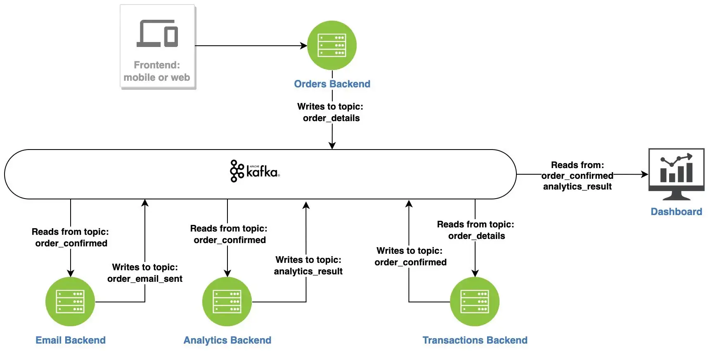

# Event-driven-app
This app is designed to break down the event driven architecture for modern apps 

# Architecture of the project : 
 

Requirements :
Docker 
Python 
Kafka 

# Notes : 
As you can see in the architecture , we have a lot of services : order backend , email backend , analytics backend and transactions backend . Each one of these services will be dockerized , so under each folder of the services you will find a specific Dockerfile . 

# The different steps explained 
### 1. Produce data to kafka : 
files : orders_backend.py , docker-compose-kafka.yaml , docker-compose-services.yaml 
### 2. Read from topic , process the data and produce to another topic : 
files : transactions_backend.py ,email_backend.py , docker-compose-kafka.yaml , docker-compose-services.yaml 
### 3. Read from topic and do some analysis : 
files : analytics_backend.py , docker-compose-kafka.yaml , docker-compose-services.yaml  
